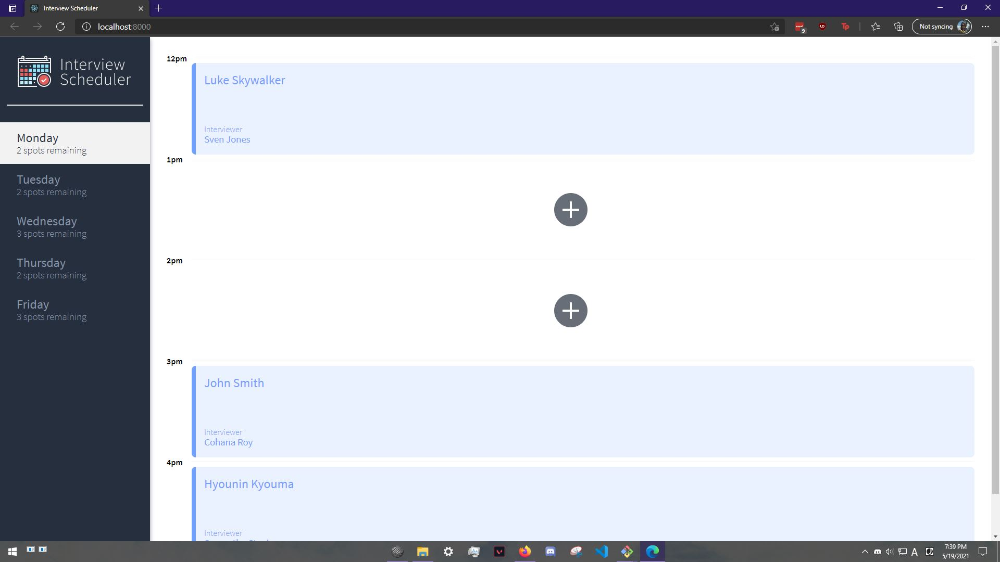
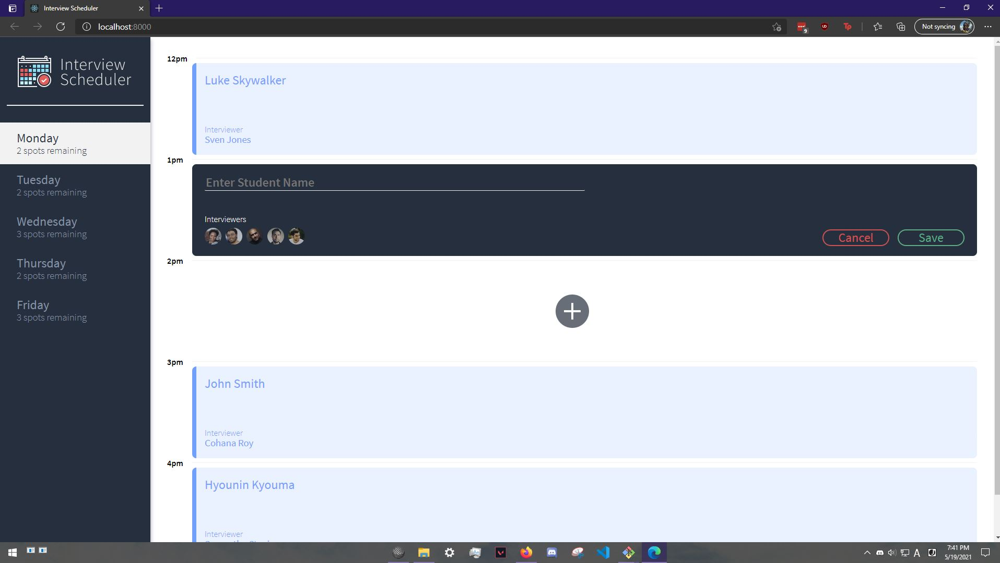
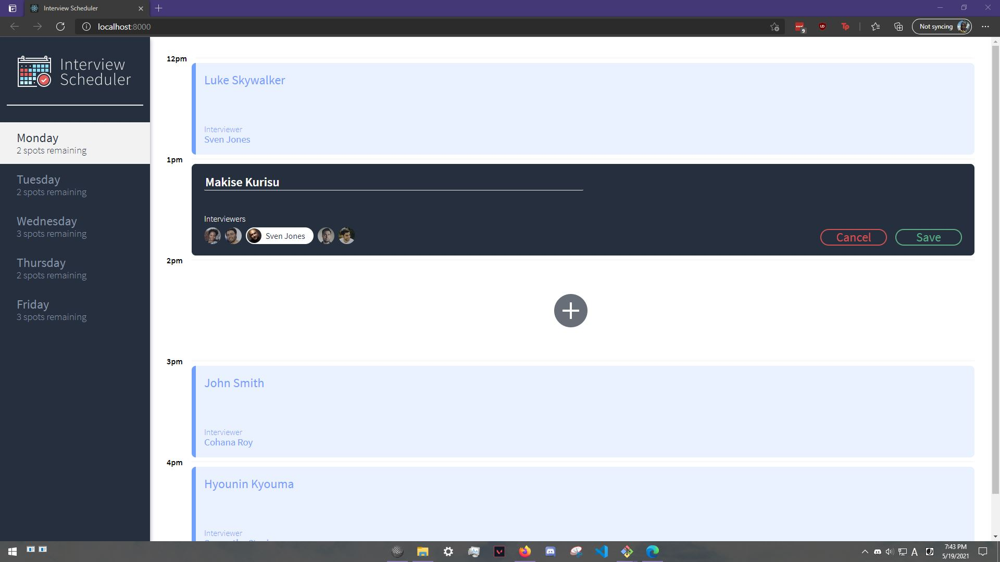
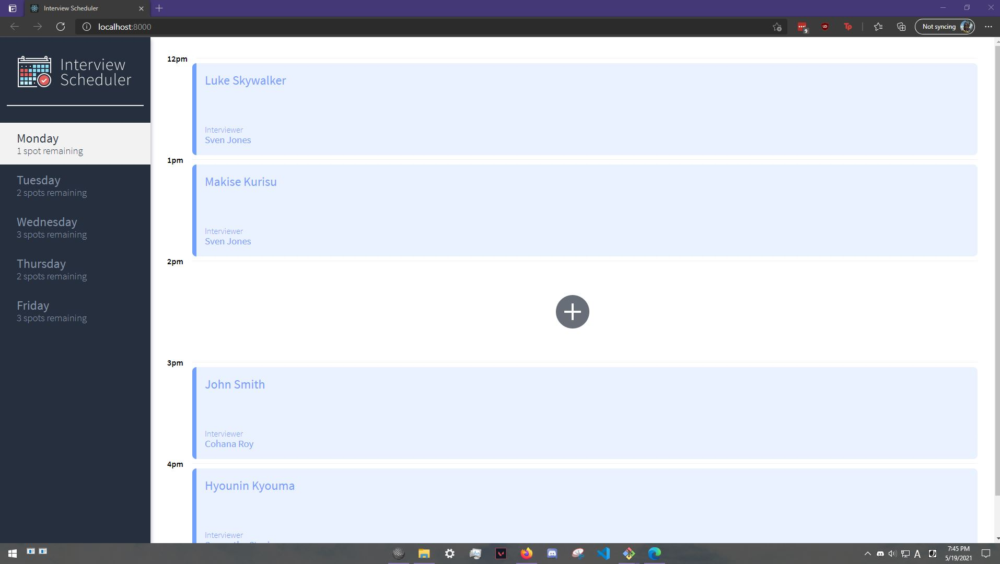
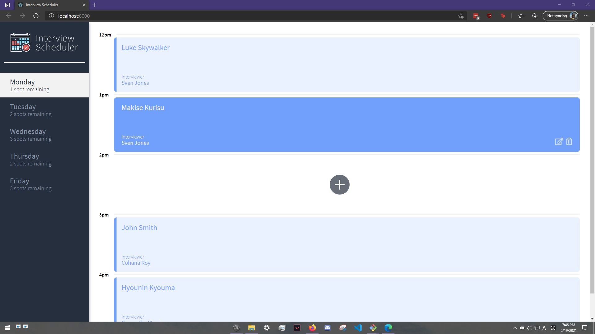
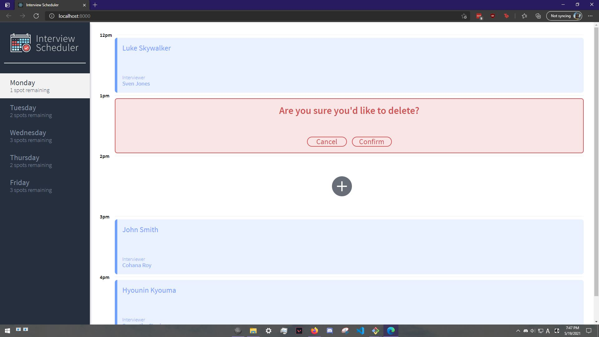
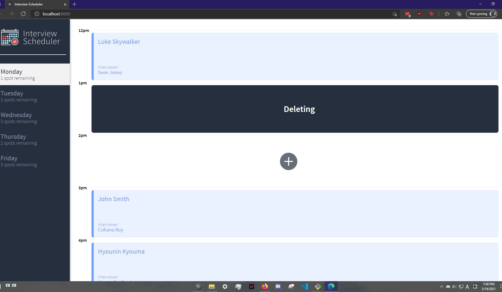
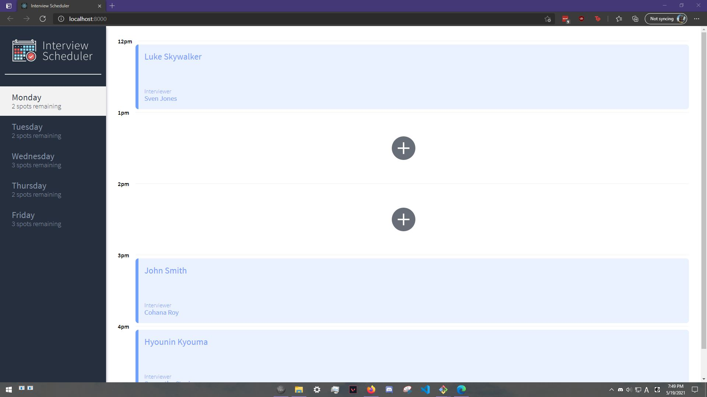
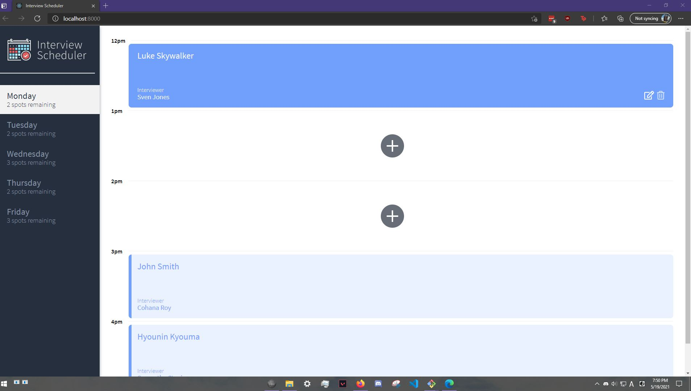
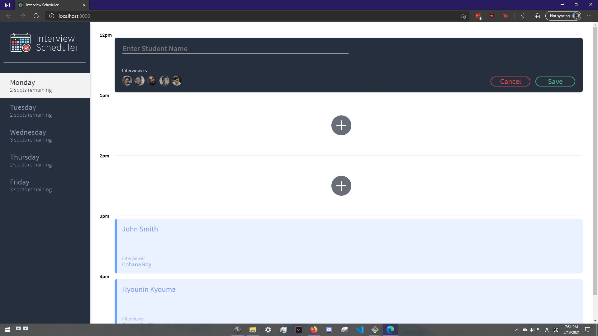

# The Scheduler Project

---

Scheduler is a simple app designed for HR to keep track of interviews! The app allows them to book, and cancel interviews!

The site predominantly uses the technologies, React, to allow for quick and snappy execution while allowing for highly readable code!

Before you start you'll need to also download the [api](https://github.com/alvinoalvin/scheduler-api)

## Dependencies

- @testing-library/react-hooks
- axios
- classnames
- normalize.css
- react
- react-dom
- react-scripts

## devDependencies

- @babel/core
- @storybook/addon-actions
- @storybook/addon-backgrounds
- @storybook/addon-links
- @storybook/addons
- @storybook/react
- @testing-library/jest-dom
- @testing-library/react
- babel-loader
- node-sass
- prop-types

## Getting Started
- We'll be using the ports 8000 and 8001 so make sure nothing's on these ports.
- clone the api server [api-server](https://github.com/alvinoalvin/scheduler-api)
- Install all dependencies on both the project and api servers. (using the `npm install` command).
- create a database development
- Copy the .env.example to .env.development and fill in the variables.
- run the creation script in src/db/schema on the development psql server
- run a curl request to `localhost:8001/api/debug/reset` to reset the database
- Run the development web server using the `npm start` command.
- Run the development api server using the `npm start` command.

## User Guide
### Creating an appointment 
Click the + icon to get to the create form.

Enter the student's name, and choose an interviewer. Then press save.

You'll see a Saving Icon, and then the booked appointment

### Cancel an appointment 
Click the Trash Can icon to get to the create form.

Click Confirm

You'll see the deleting icon, and the appointment will be cancelled

### Editing an appointment 
Click the pen and paper icon to get to the create form.

Repeat the steps from the Creating an Appointment section

